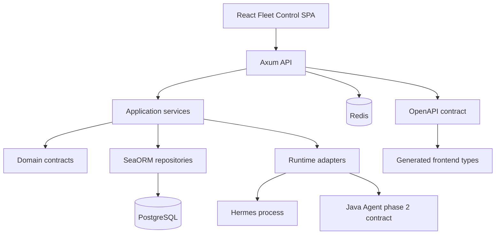

<p align="center">
  
</p>

<p align="center">
  <a href="#features"></a>
  <a href="#stack"></a>
  <a href="#routes"></a>
  <a href="#screenshots"></a>
  <a href="#architecture"></a>
  <a href="#quality"></a>
  <a href="#license"></a>
</p>

<p align="center">
  
  
  
  
  
  
  
  
</p>

<p align="center">
  
</p>

---

## 🎯 Позиционирование

**Fleet Control** — internal SDLC control plane для FerrPOINT: управление
флотом изолированных agent runtimes, их config/workspace, skills, sessions,
handoff и namespace/workflow bindings.

Первый полноценно реализованный runtime — **Hermes**. **Java Agent** виден в
модели, API, create wizard и capability matrix с первого дня, а runtime
provision/start остаётся phase 2 contract.

## 📌 Snapshot

| Поле | Значение |
| --- | --- |
| Product | `fleet-control` |
| Backend | Rust 2024, Axum, SeaORM |
| Data | PostgreSQL 17, Redis 8 |
| Frontend | React 19, Vite, Tailwind CSS |
| API | Canonical contract in [openapi/openapi.json](openapi/openapi.json) |
| Ports | Frontend `23802`, backend `23801` |
| Runtime types | `hermes`, `java_agent` |
| License | FerrPOINT Proprietary Source-Available Evaluation License v1.0 |

<a name="features"></a>

## ✨ Features

| Feature | Описание |
| --- | --- |
| Agent fleet | Sequential `agent1`, `agent2`, `agent3` identities with per-agent runtime folders. |
| Runtime isolation | Separate `runtime`, `config`, `workspace` and `logs` directories for every agent. |
| Hermes control | Provision, start, stop, restart, health and log surfaces for Hermes. |
| Java Agent contract | Reserved Spring Boot adapter shape, ports, health and session/chat endpoints. |
| Skills and config | Per-agent skills, SOUL, config JSON and redacted env editing. |
| Task sessions | User-owned chat/task sessions with per-agent and cross-agent views. |
| User filters | Sessions default to the current user, can expand to all users or filter by several users. |
| Workflow bindings | Namespace/workflow binding state stored locally while `project-workflow` owns workflow definitions. |
| Audit evidence | Events, process logs, API docs, tests and screenshot manifests are part of the repo. |

## 🧩 Capability Details

| Area | Details |
| --- | --- |
| Hermes layout | `HERMES_HOME=data/agents/agentN/config`, cwd `data/agents/agentN/workspace`. |
| Java Agent layout | `AGENT_SERVER_PORT`, `SPRING_CONFIG_ADDITIONAL_LOCATION`, `/actuator/health`, `/api/v2/sessions`, `/v1/capabilities`. |
| Session ownership | `agent_sessions.user_id` references the authenticated user that created the session. |
| Agent naming | Agent ordinals come from database allocation and materialize `agentN` folders. |
| Deletion model | Agent delete means archive/stop by default; physical purge is a separate explicit operation. |

<a name="stack"></a>

## 🔧 Core Stack

| Zone | Tech | Роль |
| --- | --- | --- |
| API | Rust + Axum | HTTP routes, auth, DTO boundary and OpenAPI source |
| Domain/App | Rust workspace crates | runtime policies, repository contracts and events |
| Persistence | SeaORM + PostgreSQL | agents, configs, skills, sessions, logs and migrations |
| Cache/Push | Redis + SSE | runtime support and event stream |
| Frontend | React + Vite + Tailwind | operational fleet UI |
| Contract | OpenAPI | generated frontend API types |
| Evidence | Playwright screenshots | UI coverage across desktop and mobile viewports |

## ⚡ Quick Start

```bash
cp .env.example .env
# Replace POSTGRES_PASSWORD and FLEET_CONTROL_JWT_SECRET in .env
docker compose up -d
curl http://127.0.0.1:23801/api/v1/health
```

Frontend dev:

```bash
cd frontend
pnpm install
pnpm generate:api
pnpm dev
```

Backend dev:

```bash
cd backend
cargo run -p server
```

Open:

- Frontend dev: `http://127.0.0.1:5173`
- Frontend Docker: `http://127.0.0.1:23802`
- Backend: `http://127.0.0.1:23801/api/v1/health`
- API docs: `http://127.0.0.1:23801/swagger-ui/`

The first registered user becomes system admin.

<a name="routes"></a>

## 🧭 Frontend Routes

| Route | Назначение |
| --- | --- |
| `/login`, `/register` | Auth |
| `/`, `/dashboard` | Fleet dashboard |
| `/agents` | Agent list with session ownership filter |
| `/agents/new` | Create agent wizard |
| `/agents/:agentId` | Agent overview |
| `/agents/:agentId/runtime` | Runtime provision/start/stop/restart/health |
| `/agents/:agentId/skills` | Per-agent skills |
| `/agents/:agentId/config` | Config, SOUL and env editor |
| `/agents/:agentId/workspace` | Guarded workspace overview |
| `/agents/:agentId/sessions` | Agent-local sessions |
| `/sessions` | Cross-agent task sessions |
| `/sessions/:sessionId` | Session detail and handoff |
| `/workflows` | Namespace/workflow bindings |
| `/deployments` | Runtime templates and deployment surface |
| `/logs` | Global logs and event stream |
| `/settings` | Root paths, runtime sources, integrations and users |

<a name="screenshots"></a>

## 🖼️ Screenshots

Recapture parameters and the full 53-file evidence set are tracked in
[docs/assets/screens/manifest.md](docs/assets/screens/manifest.md). Every core
screen is captured at `375x812`, `1920x1080` and `2560x1440`.

| Route | Screenshot |
| --- | --- |
| `/login` | [01-login.png](docs/assets/screens/1920x1080/01-login.png) |
| `/register` | [02-register.png](docs/assets/screens/1920x1080/02-register.png) |
| `/` | [03-dashboard.png](docs/assets/screens/1920x1080/03-dashboard.png) |
| `/agents` | [04-agents.png](docs/assets/screens/1920x1080/04-agents.png) |
| `/agents/new` | [05-agent-create.png](docs/assets/screens/1920x1080/05-agent-create.png) |
| `/agents/:agentId` | [06-agent-overview.png](docs/assets/screens/1920x1080/06-agent-overview.png) |
| `/agents/:agentId/runtime` | [07-agent-runtime.png](docs/assets/screens/1920x1080/07-agent-runtime.png) |
| `/agents/:agentId/skills` | [08-agent-skills.png](docs/assets/screens/1920x1080/08-agent-skills.png) |
| `/agents/:agentId/config` | [09-agent-config.png](docs/assets/screens/1920x1080/09-agent-config.png) |
| `/agents/:agentId/workspace` | [10-agent-workspace.png](docs/assets/screens/1920x1080/10-agent-workspace.png) |
| `/agents/:agentId/sessions` | [11-agent-sessions.png](docs/assets/screens/1920x1080/11-agent-sessions.png) |
| `/sessions` | [12-sessions.png](docs/assets/screens/1920x1080/12-sessions.png) |
| `/sessions/:sessionId` | [13-session-detail.png](docs/assets/screens/1920x1080/13-session-detail.png) |
| `/workflows` | [14-workflows.png](docs/assets/screens/1920x1080/14-workflows.png) |
| `/deployments` | [15-deployments.png](docs/assets/screens/1920x1080/15-deployments.png) |
| `/logs` | [16-logs.png](docs/assets/screens/1920x1080/16-logs.png) |
| `/settings` | [17-settings.png](docs/assets/screens/1920x1080/17-settings.png) |

Mobile smoke: [dashboard](docs/assets/screens/375x812/18-mobile-dashboard.png)
and [agent detail](docs/assets/screens/375x812/19-mobile-agent-detail.png).

<a name="architecture"></a>

## 🏗️ Architecture



## 🧱 Boundaries

- `task-tracker` was used only as stack/UI/docs donor; sibling SDLC repos are not mutated.
- `project-workflow` remains the source of truth for workflow and namespace definitions.
- Java Agent provisioning is intentionally blocked until the runtime adapter is implemented.
- Filesystem operations must stay under the configured agents root and secrets must be redacted.

<a name="quality"></a>

## 🛡️ Quality Bar

| Проверка | Команда |
| --- | --- |
| Frontend typecheck | `cd frontend && pnpm typecheck` |
| Frontend lint | `cd frontend && pnpm lint` |
| Frontend unit tests | `cd frontend && pnpm test` |
| Frontend build | `cd frontend && pnpm build` |
| Playwright e2e | `cd frontend && pnpm test:e2e -- --project=chromium` |
| Screenshots | `cd frontend && pnpm screenshots` |
| Backend format | `cd backend && cargo fmt --all -- --check` |
| Backend compile | `cd backend && cargo check --workspace --all-targets` |
| Backend clippy | `cd backend && cargo clippy --workspace --all-targets -- -D warnings` |
| Backend tests | `cd backend && cargo test --workspace` |
| CI | GitHub Actions: backend, frontend, migrations, OpenAPI and e2e |

## 🧭 Project Map

```text
fleet-control/
├── backend/     # Rust workspace: api, app, domain, infra, shared, server, cli, migration
├── frontend/    # React SPA: pages, widgets, generated API client and Playwright tests
├── openapi/     # canonical generated API contract
├── docs/        # requirements, architecture, contracts, operations, security and screenshots
├── .github/     # CI workflow
└── docker-compose.yml
```

## 📚 Документы

- [docs/README.md](docs/README.md) — documentation overview.
- [docs/TZ.md](docs/TZ.md), [docs/PRODUCT_REQUIREMENTS.md](docs/PRODUCT_REQUIREMENTS.md) — scope and requirements.
- [docs/ARCHITECTURE.md](docs/ARCHITECTURE.md), [docs/FRONTEND_ARCHITECTURE.md](docs/FRONTEND_ARCHITECTURE.md), [docs/contracts](docs/contracts) — architecture and contracts.
- [docs/DATA_MODEL.md](docs/DATA_MODEL.md), [docs/API.md](docs/API.md), [docs/ENV.md](docs/ENV.md) — technical references.
- [docs/LOCAL_SETUP.md](docs/LOCAL_SETUP.md), [docs/DEPLOYMENT.md](docs/DEPLOYMENT.md), [docs/OPERATIONS.md](docs/OPERATIONS.md) — runbooks.
- [docs/SECURITY.md](docs/SECURITY.md), [docs/THREAT_MODEL.md](docs/THREAT_MODEL.md) — security model.
- [docs/TESTING.md](docs/TESTING.md), [docs/RISK_REGISTER.md](docs/RISK_REGISTER.md), [docs/TRACEABILITY.md](docs/TRACEABILITY.md) — quality and traceability.
- [docs/assets/screens/manifest.md](docs/assets/screens/manifest.md) — screenshot manifest.

<a name="license"></a>

## 🔒 License

Proprietary source-available. Not open source.

Viewing/evaluation only.

Commercial, production, resale, redistribution, SaaS/hosting use require written
license from FerrPOINT. См. [LICENSE](LICENSE), [NOTICE](NOTICE) и
[THIRD_PARTY_NOTICES.md](THIRD_PARTY_NOTICES.md).

<p align="center">
  
</p>
