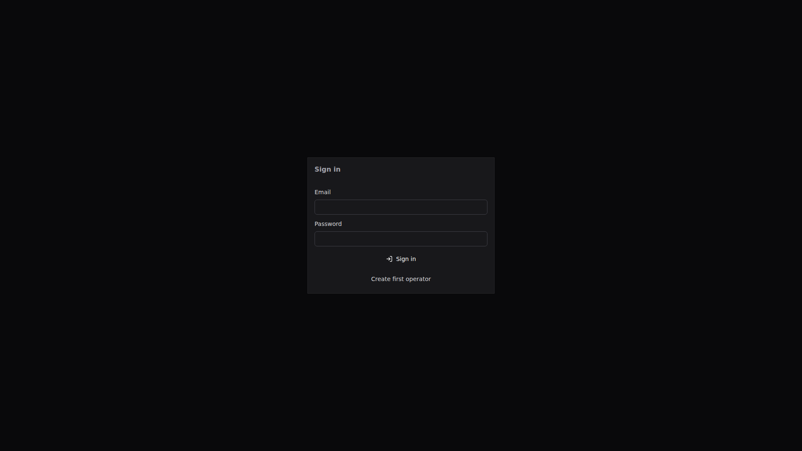
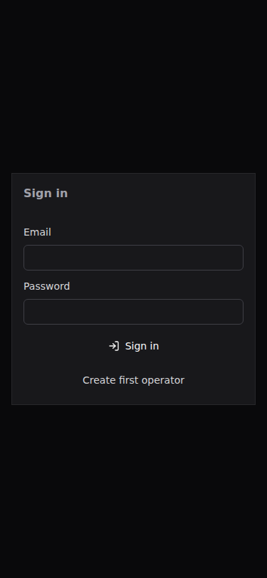

<p align="center">
  
</p>

<p align="center">
  <a href="#capabilities"></a>
  <a href="#quick-start"></a>
  <a href="#visual-proof"></a>
  <a href="#safety"></a>
  <a href="#quality"></a>
</p>

<p align="center">
  
  
  
  
  
  
</p>

> **Base Fleet Control** is a self-hosted control plane for isolated agent runtimes, their sessions, skills, configuration, storage and runtime lifecycle. It manages the runtime boundary; it does not replace the workflow, documentation or CI/CD systems connected to that boundary.

<a name="overview"></a>
## Overview

Fleet Control is an API-backed React application and a Rust control-plane workspace. It separates runtime implementation (`hermes`, `java_agent`) from product role (`leader`, `executor`) and keeps every managed agent within an isolated runtime/config/workspace/log layout.

| Surface | Current behavior | Boundary |
|---|---|---|
| Agents | Create and archive technical agents; manage profiles, skills, configuration, workspace/storage views and sessions. | Physical purge is an explicit guarded operation beneath the configured agents root. |
| Runtime lifecycle | Provision, start, stop, restart, health and logs through runtime adapters. | The control plane owns orchestration, not the agent's private session database. |
| Hermes | Managed Hermes processes use an isolated home and workspace per agent. | Two managed agents never share a Hermes home. |
| Java Agent | The adapter provisions/starts an externally supplied JAR and checks its readiness endpoint. | The JAR and JDK are operator-provisioned; a missing JAR fails validation rather than being invented or downloaded. |
| Sessions | Private-by-default task sessions, leader/executor binding, control-message mirrors and runtime run links. | `project-workflow` owns workflow definitions; Fleet stores bindings only. |
| Interfaces | React UI, public API, OpenAPI artifact, SSE and configurable Prometheus metrics. | `wiki` owns knowledge/evidence; Forge CI/CD owns build and deployment pipelines. |

The runtime model and external ownership boundaries are documented in [docs/ARCHITECTURE.md](docs/ARCHITECTURE.md) and [docs/contracts](docs/contracts).

<a name="capabilities"></a>
## Capabilities

- **Isolated runtime layouts.** Assign every agent an ordinal-backed runtime, config, workspace and logs area; guard filesystem actions under the configured root.
- **Agent operations.** Manage Hermes and Java Agent adapter lifecycles, environment/configuration views, skill files, storage reports, runtime logs and deployment-job history.
- **Leader and executor control.** Bind leaders to executors and link task sessions to a selected leader without conflating an agent's runtime kind with its product role.
- **Session evidence.** Store control-plane message mirrors and runtime-run links with idempotent creation; preserve private-by-default session ownership.
- **Identity and observability.** Use local or configured central-auth validation/login bridging, request IDs, audit/events, rate controls, health and Prometheus metrics.

<a name="quick-start"></a>
## Quick Start

Repository Compose has no usable defaults for database, session or runtime-token secrets. Copy the template, set operator-owned values and keep `.env` ignored.

```bash
cp .env.example .env
# Edit .env: set POSTGRES_PASSWORD, FLEET_CONTROL_JWT_SECRET and
# FLEET_CONTROL_FLEET__RUNTIME_TOKEN_SECRET.
docker compose up --build -d
curl -fsS http://127.0.0.1:23801/api/v1/health
```

Repository-local defaults are frontend `23802` and API `23801`; PostgreSQL and Redis remain internal. In the Base umbrella runtime, frontend/API are published at `7742`/`7741`; those are deployment-local coordinates, not public endpoints.

For runtime wiring and operator procedures, read [docs/LOCAL_SETUP.md](docs/LOCAL_SETUP.md), [docs/DEPLOYMENT.md](docs/DEPLOYMENT.md), [docs/OPERATIONS.md](docs/OPERATIONS.md), [docs/API.md](docs/API.md) and [docs/ENV.md](docs/ENV.md).

<a name="visual-proof"></a>
## Visual Proof

The root README intentionally uses only blank initial-operator sign-in evidence. It excludes dashboard, alerts, session and runtime screens because even deterministic fixtures reveal agent names, namespaces, UUID-shaped values, locale-specific timestamps or internal roadmap context. The complete 132-screen route inventory and capture contract remain in [docs/assets/screens/manifest.md](docs/assets/screens/manifest.md).

### Initial operator boundary



### Initial operator boundary on mobile



The mobile proof is captured at `375x812`; both fields are blank and neither browser chrome nor a deployment identifier is present.

<a name="safety"></a>
## Safety Boundaries

- **Filesystem guard.** Runtime, config, workspace and logs operations remain under the configured agents root. Storage reports use the same guarded layout as provisioning and purge.
- **Process isolation.** Managed Hermes runtimes receive dedicated home/workspace paths. Java Agent requires an operator-supplied runtime JAR and configured Java command before start is allowed.
- **Secret handling.** Configuration/env output is redacted; never commit `.env`, runtime tokens, credentials or copied process logs containing secrets.
- **Authority split.** Fleet mirrors control-plane messages and dispatches through adapters; it does not write directly into agent-private state. Workflow, documentation and CI/CD ownership remain with their respective Base products.
- **Network and metrics.** PostgreSQL/Redis are internal in repository Compose. `/metrics` is configurable for internal scraping and does not replace authorization, ingress or network policy.

Review [docs/SECURITY.md](docs/SECURITY.md), [docs/THREAT_MODEL.md](docs/THREAT_MODEL.md) and the runtime contracts before operating a shared fleet.

<a name="quality"></a>
## Quality and Verification

| Gate | Command |
|---|---|
| README contract tests | `python3 -m unittest scripts.tests.test_verify_readme -v` |
| README assets and anchors | `python3 scripts/verify_readme.py` |
| Backend workspace | `cd backend && cargo fmt --all -- --check && cargo clippy --workspace --all-targets -- -D warnings && cargo test --workspace -- --test-threads=1` |
| Frontend API/type/test/lint/build | `cd frontend && pnpm openapi:check && pnpm typecheck && pnpm test -- --run && pnpm lint && pnpm format:check && pnpm build` |
| Browser E2E | `cd frontend && pnpm test:e2e -- --project=chromium` |
| Screenshot manifest | `cd frontend && pnpm screenshots:verify` |
| Compose contract | `docker compose config -q` |
| Runtime liveness | `curl -fsS http://127.0.0.1:23801/api/v1/health` |

GitHub Actions runs backend, OpenAPI, migrations, dependency checks, frontend and browser-E2E gates. The independent README job guards required anchors, reviewed evidence, local images, placeholders and accidental local filesystem paths.

## Documentation Map

- **Scope and architecture:** [docs/TZ.md](docs/TZ.md), [docs/PRODUCT_REQUIREMENTS.md](docs/PRODUCT_REQUIREMENTS.md), [docs/ARCHITECTURE.md](docs/ARCHITECTURE.md)
- **Runtime contracts:** [docs/contracts/AGENT_RUNTIME_CONTRACT.md](docs/contracts/AGENT_RUNTIME_CONTRACT.md), [docs/contracts/HERMES_ADAPTER_CONTRACT.md](docs/contracts/HERMES_ADAPTER_CONTRACT.md), [docs/contracts/JAVA_AGENT_ADAPTER_CONTRACT.md](docs/contracts/JAVA_AGENT_ADAPTER_CONTRACT.md)
- **API and data:** [docs/API.md](docs/API.md), [docs/DATA_MODEL.md](docs/DATA_MODEL.md), [openapi/openapi.json](openapi/openapi.json)
- **Operators:** [docs/LOCAL_SETUP.md](docs/LOCAL_SETUP.md), [docs/DEPLOYMENT.md](docs/DEPLOYMENT.md), [docs/OPERATIONS.md](docs/OPERATIONS.md)
- **Security and quality:** [docs/SECURITY.md](docs/SECURITY.md), [docs/THREAT_MODEL.md](docs/THREAT_MODEL.md), [docs/TESTING.md](docs/TESTING.md)

<a name="license"></a>
## License

FerrPOINT Proprietary Source-Available Evaluation License v1.0. This repository is not open source. Viewing and evaluation are allowed under [LICENSE](LICENSE); commercial, production, resale, redistribution and SaaS/hosting use require a written FerrPOINT license. See [NOTICE](NOTICE) and [THIRD_PARTY_NOTICES.md](THIRD_PARTY_NOTICES.md).
