<p align="center">
  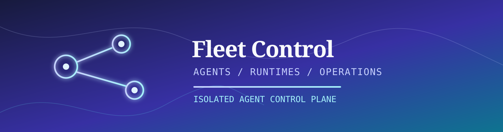
</p>

<p align="center">
  <a href="#overview"></a>
  <a href="#capabilities"></a>
  <a href="#routes"></a>
  <a href="#quick-start"></a>
  <a href="#visual-proof"></a>
  <a href="#safety"></a>
  <a href="#quality"></a>
</p>

<p align="center">
  
  
  
  
  
  
  
  
</p>

---

> **Base Fleet Control** — self-hosted control plane для изолированных agent runtime: лидеры, исполнители, технические агенты, их сессии, skills, конфигурация, storage, деплой и lifecycle. Управляет runtime-границей; не заменяет workflow, документацию или CI/CD-системы за этой границей. Env-префикс: `FLEET_CONTROL_`.

<a name="overview"></a>

## Обзор и Snapshot

| Поле | Значение |
|---|---|
| Backend | Rust 2024 workspace: api, app, domain, infra, shared, server, cli, migration |
| Data | PostgreSQL 17 (agents, configs, skills, sessions, logs), Redis 8 + SSE |
| Frontend | React 19, Vite, Tailwind CSS |
| Runtime adapters | Hermes (изолированный home/workspace), Java Agent (operator-provided JAR) |
| API | [openapi/openapi.json](openapi/openapi.json) — canonical contract |
| Порты | repository-local: frontend `23802`, backend `23801`; Base umbrella: frontend `7742`, API `7741` |
| License | FerrPOINT Proprietary Source-Available Evaluation License v1.0 |

Первый зарегистрированный пользователь получает `system_role = admin`.

<a name="capabilities"></a>

## Возможности

| Feature | Описание |
|---|---|
| Leader/executor модель | `agents.product_role` (leader/executor) отделён от `agents.kind` (runtime type). |
| Технические агенты | Создание, архивирование, profiles, skills, конфигурация, workspace/storage view и сессии. |
| Runtime lifecycle | Provision, start, stop, restart, health и logs через runtime adapters. |
| Сессии | Private-by-default task sessions, привязка к лидеру, control-message mirrors и runtime run links. |
| Workflows | Namespace/workflow bindings (source of truth — `project-workflow`). |
| Deployments | Runtime templates и deployment jobs. |
| Алерты | Fleet alerts page с bulk runtime update panel. |
| Наблюдаемость | Request id, audit/events, rate controls, health и Prometheus metrics. |

## Стек

| Zone | Tech | Роль |
|---|---|---|
| API | Rust + Axum | HTTP routes, auth, DTO boundary |
| Domain/App | Rust workspace crates | services, policies, repository contracts |
| Persistence | SeaORM + PostgreSQL | runtime data и migrations |
| Cache/Push | Redis + SSE | runtime support и event stream |
| Shared Base | services-base-aligned | fleet-standard request id и tracing bridge |
| Frontend | React + Vite + Tailwind | operational fleet UI |
| Contract | OpenAPI | generated frontend API types |
| Evidence | Playwright screenshots | UI coverage desktop и mobile viewports |

<a name="quick-start"></a>

## Быстрый старт

```bash
cp .env.example .env
# Заменить POSTGRES_PASSWORD, FLEET_CONTROL_JWT_SECRET и
# FLEET_CONTROL_FLEET__RUNTIME_TOKEN_SECRET в .env
docker compose up --build -d
curl -fsS http://127.0.0.1:23801/api/v1/health
```

Frontend dev:

```bash
cd frontend
pnpm install
pnpm generate:api
pnpm dev
```

Backend dev:

```bash
cd backend
cargo run -p server
```

- Frontend dev: `http://127.0.0.1:5173`
- Frontend Docker: `http://127.0.0.1:23802`
- Backend: `http://127.0.0.1:23801/api/v1/health`
- API docs: `http://127.0.0.1:23801/swagger-ui/`

<a name="routes"></a>

## Фронтенд-роуты

| Route | Назначение |
| --- | --- |
| `/login`, `/register` | Auth |
| `/`, `/dashboard` | Fleet dashboard |
| `/leaders` | Leader agents, managed executors и leader-scoped sessions |
| `/leaders/new` | Создание leader wizard |
| `/leaders/:leaderId` | Leader team editor и sessions |
| `/leaders/:leaderId/edit` | Leader identity, profile, workflow и team edit |
| `/executors` | Executor agents и task sessions |
| `/executors/new` | Создание executor wizard |
| `/executors/:agentId` | Executor overview |
| `/executors/:agentId/edit` | Executor identity, profile и workflow edit |
| `/agents` | Технический инвентарь агентов с фильтром session ownership |
| `/agents/new` | Создание generic agent wizard |
| `/agents/:agentId` | Agent overview |
| `/agents/:agentId/edit` | Generic agent identity edit |
| `/agents/:agentId/runtime` | Runtime provision/start/stop/restart/health |
| `/agents/:agentId/skills` | Per-agent skills |
| `/agents/:agentId/config` | Config, SOUL и env editor |
| `/agents/:agentId/workspace` | Guarded workspace overview |
| `/agents/:agentId/sessions` | Agent-local sessions |
| `/sessions` | Cross-agent task sessions с user и leader фильтрами |
| `/sessions/:sessionId` | Transcript mirror, leader selector, runtime runs и handoff |
| `/workflows` | Namespace/workflow bindings |
| `/deployments` | Runtime templates и deployment surface |
| `/logs` | Global logs и event stream |
| `/settings` | Root paths, runtime sources, integrations и users |

<a name="visual-proof"></a>

## Визуальные доказательства

Скриншоты — реальные поверхности продукта, снятые на детерминированном fixture. Desktop — `1920x1080` full-page. Полный 132-файловый evidence-набор и параметры пересъёмки: [docs/assets/screens/manifest.md](docs/assets/screens/manifest.md).

### Дашборд

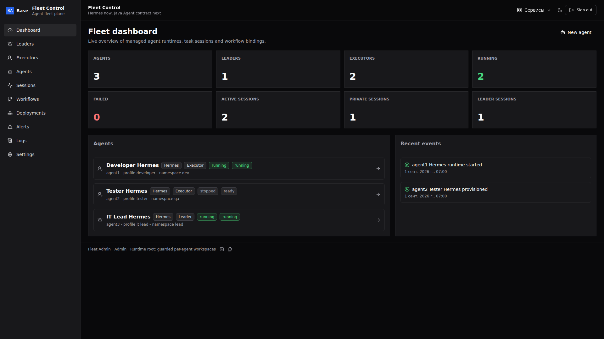

### Лидеры

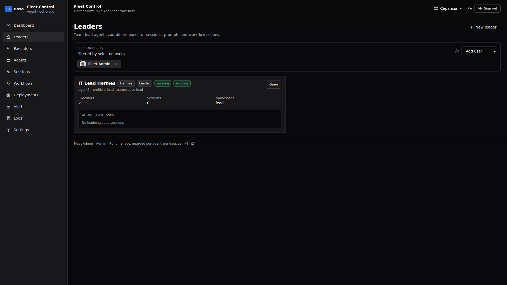

### Карточка лида

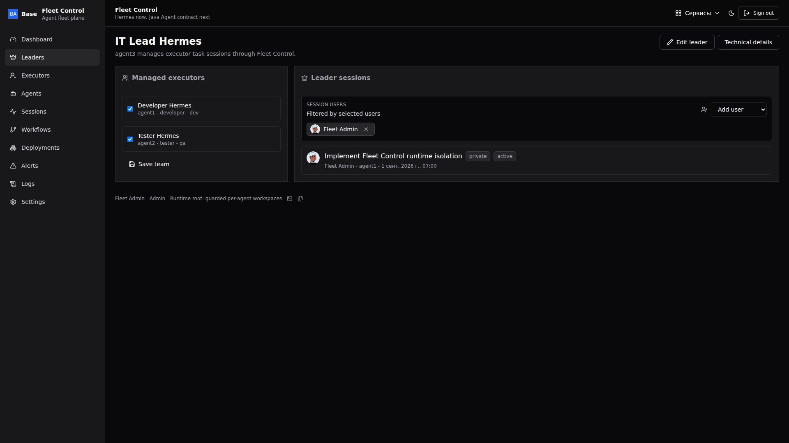

### Исполнители

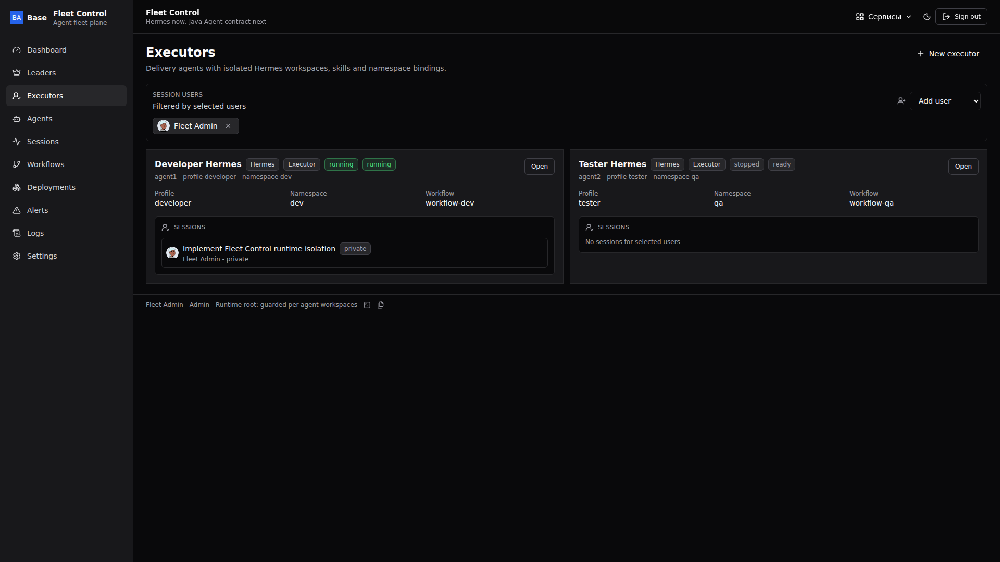

### Технические агенты

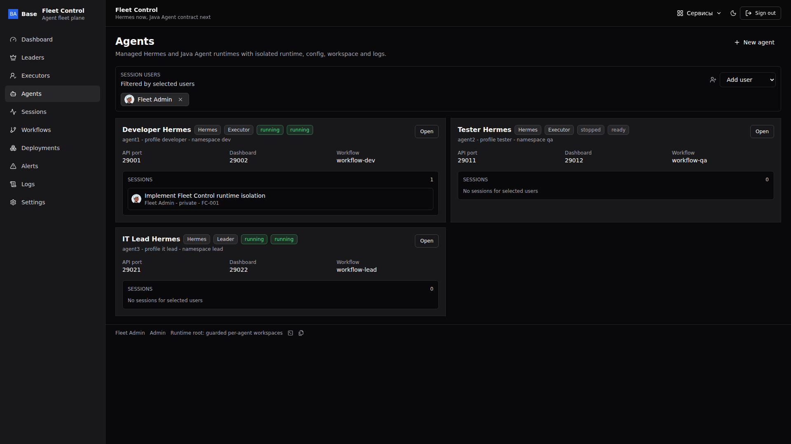

### Карточка агента

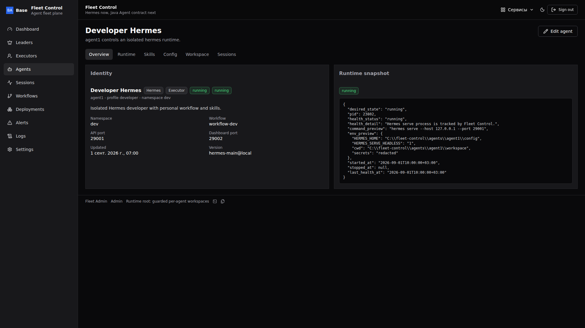

### Runtime агента

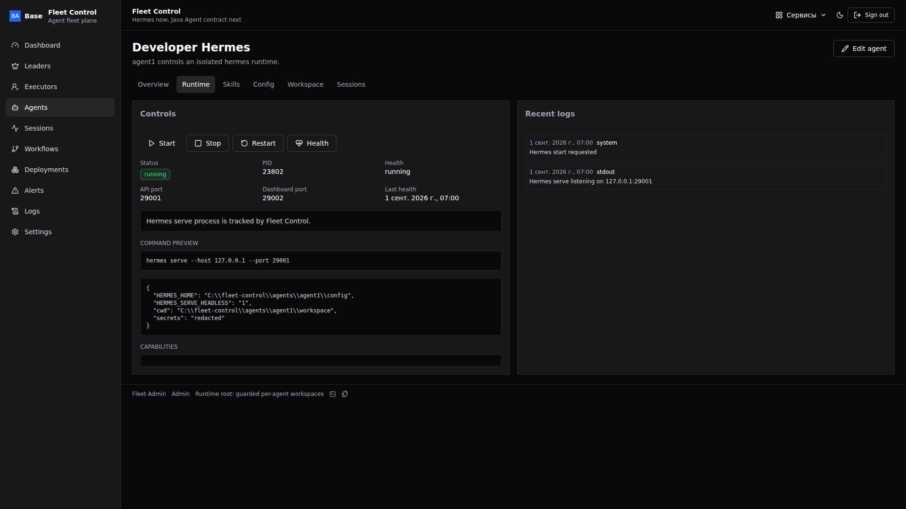

### Сессии

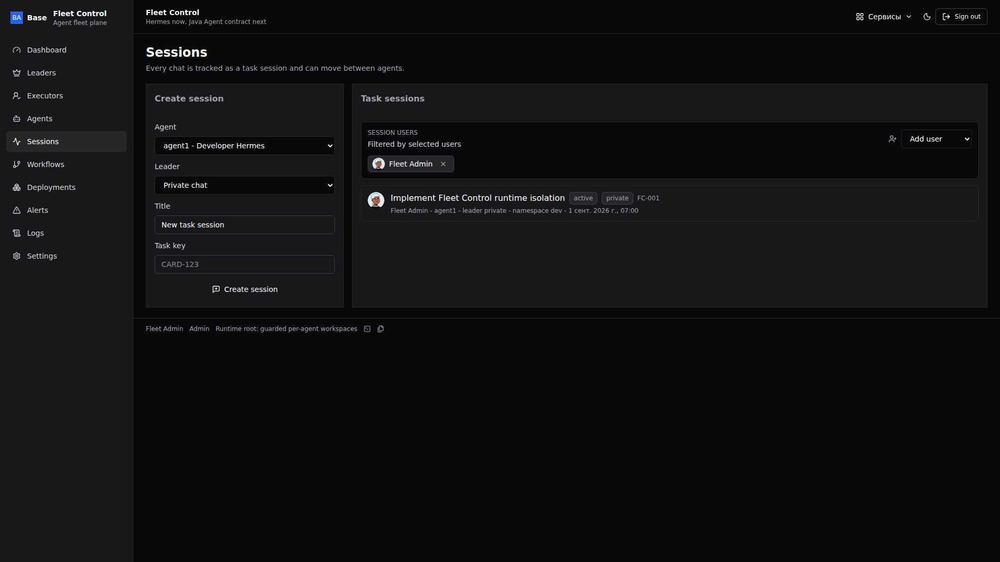

### Сессия в контексте лида

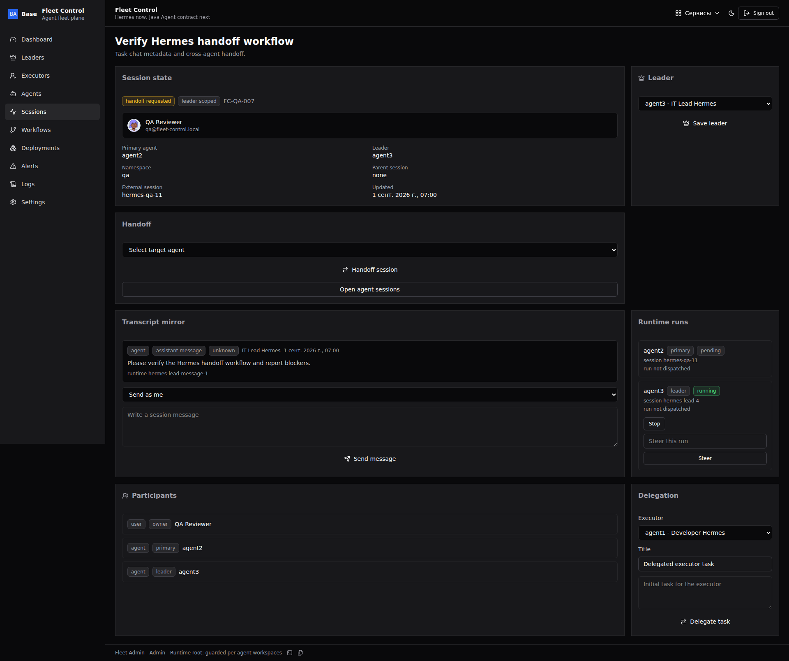

### Workflows

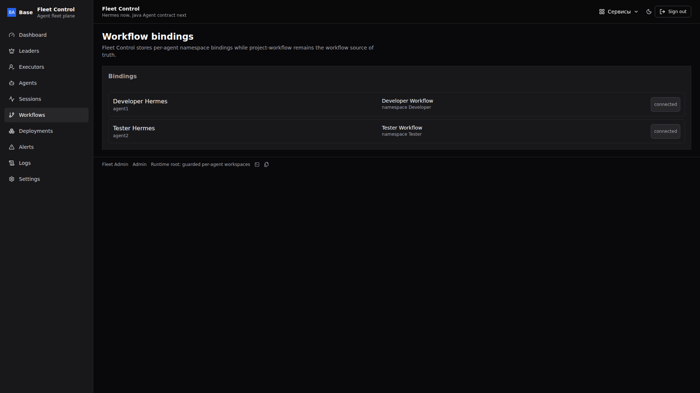

### Задания деплоя

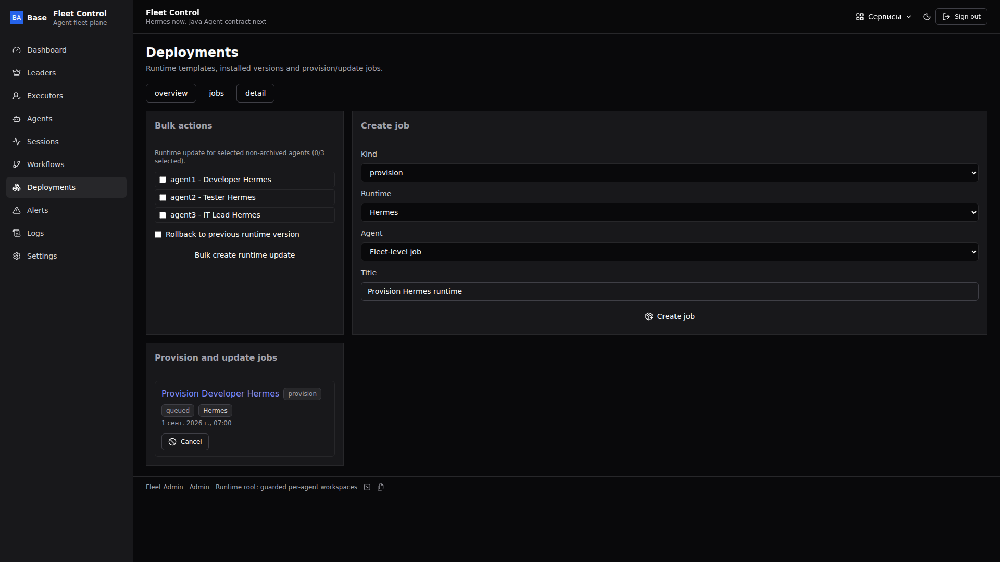

### Алерты флота

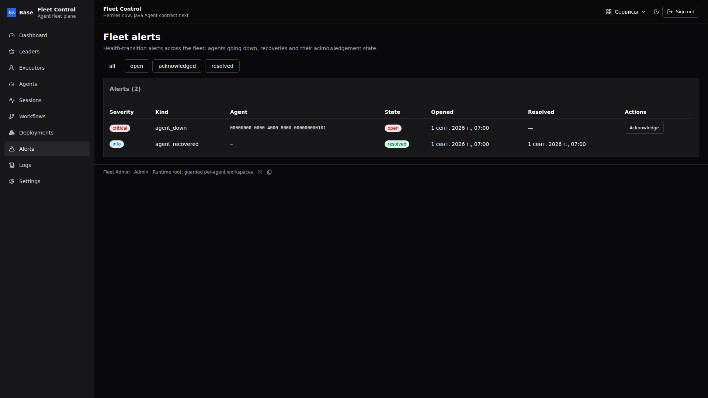

### Журнал аудита

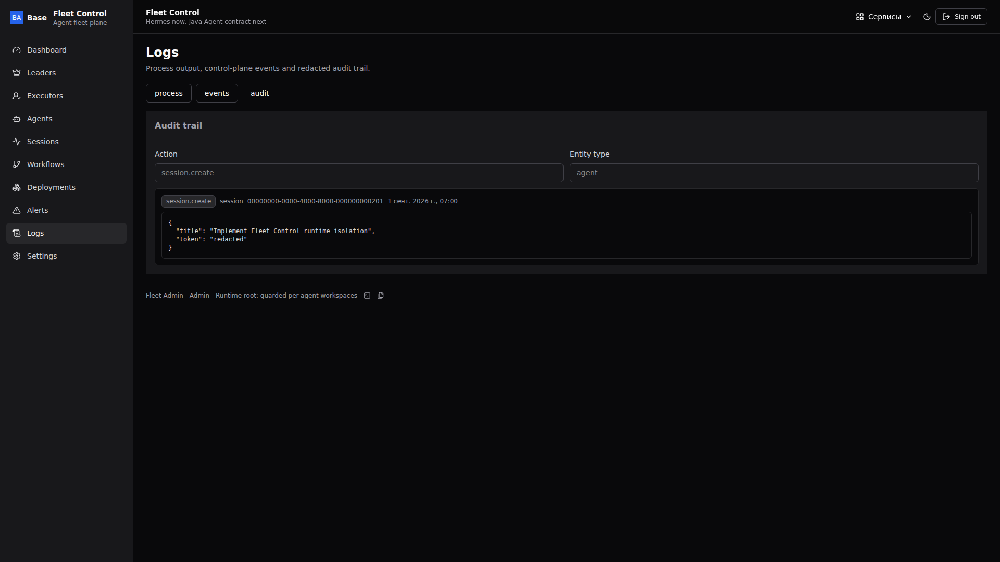

### Настройки

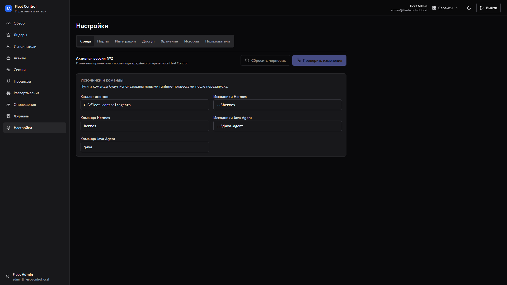

На мобильных широкие таблицы (сессии, deployment jobs, алерты) горизонтально прокручиваются внутри карточки — честная адаптивность, без урезания колонок.

## Архитектура

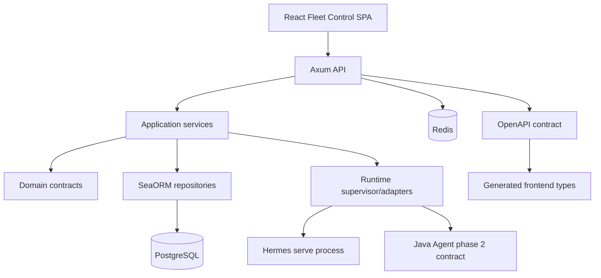

<a name="safety"></a>

## Границы

- `task-tracker` использовался только как stack/UI/docs donor; sibling fleet repos не мутируются.
- `services-base` предоставляет shared building blocks; Fleet Control использует telemetry-совместимый локальный bridge (WSL/CI не может fetch private shared repo). Auth tokens уже используют fleet-compatible HMAC claims; замена локальной валидации на `sdlc-auth-core` — отдельный шаг совместимости.
- `project-workflow` остаётся source of truth для workflow и namespace definitions.
- Java Agent provisioning намеренно заблокирован до реализации runtime adapter.
- Fleet Control зеркалит transcript/control сообщения и диспатчит через runtime boundary; он не пишет напрямую в Hermes SessionDB.
- Filesystem-операции остаются под настроенным agents root; secrets подлежат redaction.
- Physical purge — явная guarded-операция под настроенным agents root.

<a name="quality"></a>

## Качество и проверки

| Проверка | Команда |
| --- | --- |
| Frontend typecheck | `cd frontend && pnpm typecheck` |
| Frontend lint | `cd frontend && pnpm lint` |
| Frontend unit tests | `cd frontend && pnpm test` |
| Frontend build | `cd frontend && pnpm build` |
| Playwright e2e | `cd frontend && pnpm test:e2e` |
| Screenshots | `cd frontend && pnpm screenshots:local && pnpm screenshots:verify` |
| Backend format | `cd backend && cargo fmt --all -- --check` |
| Backend compile | `cd backend && cargo check --workspace --all-targets` |
| Backend clippy | `cd backend && cargo clippy --workspace --all-targets -- -D warnings` |
| Backend tests | `cd backend && cargo test --workspace` |
| README contract | `python3 scripts/verify_readme.py` |
| CI | GitHub Actions: docs, backend, OpenAPI drift и frontend gates |

## Карта проекта

```text
fleet-control/
├── backend/     # Rust workspace: api, app, domain, infra, shared, server, cli, migration
├── frontend/    # React SPA: pages, widgets, generated API client и Playwright tests
├── openapi/     # canonical generated API contract
├── docs/        # requirements, architecture, contracts, operations, security и screenshots
├── .github/     # CI workflow
└── docker-compose.yml
```

## Документы

- [docs/README.md](docs/README.md) — обзор документации.
- [docs/TZ.md](docs/TZ.md), [docs/PRODUCT_REQUIREMENTS.md](docs/PRODUCT_REQUIREMENTS.md) — scope и требования.
- [docs/ARCHITECTURE.md](docs/ARCHITECTURE.md), [docs/FRONTEND_ARCHITECTURE.md](docs/FRONTEND_ARCHITECTURE.md), [docs/contracts](docs/contracts) — архитектура и контракты.
- [docs/DATA_MODEL.md](docs/DATA_MODEL.md), [docs/API.md](docs/API.md), [docs/ENV.md](docs/ENV.md) — технические справочники.
- [docs/LOCAL_SETUP.md](docs/LOCAL_SETUP.md), [docs/DEPLOYMENT.md](docs/DEPLOYMENT.md), [docs/OPERATIONS.md](docs/OPERATIONS.md) — runbooks.
- [docs/SECURITY.md](docs/SECURITY.md), [docs/THREAT_MODEL.md](docs/THREAT_MODEL.md) — security model.
- [docs/TESTING.md](docs/TESTING.md), [docs/RISK_REGISTER.md](docs/RISK_REGISTER.md), [docs/TRACEABILITY.md](docs/TRACEABILITY.md) — качество и traceability.
- [docs/PRE_DEVELOPMENT_GATE.md](docs/PRE_DEVELOPMENT_GATE.md), [docs/GAP_REGISTER.md](docs/GAP_REGISTER.md), [docs/QUALITY_GATE.md](docs/QUALITY_GATE.md), [docs/IMPLEMENTATION_PLAN.md](docs/IMPLEMENTATION_PLAN.md) — pre-development hardening gate.
- [docs/assets/screens/manifest.md](docs/assets/screens/manifest.md) — screenshot manifest.

<a name="license"></a>

## Лицензия

Proprietary source-available. Not open source. Viewing/evaluation only.

Commercial, production, resale, redistribution, SaaS/hosting use require written license from FerrPOINT. См. [LICENSE](LICENSE), [NOTICE](NOTICE) и [THIRD_PARTY_NOTICES.md](THIRD_PARTY_NOTICES.md).
