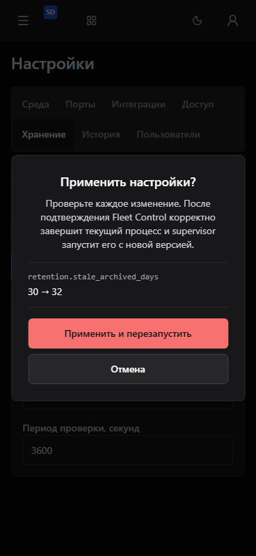
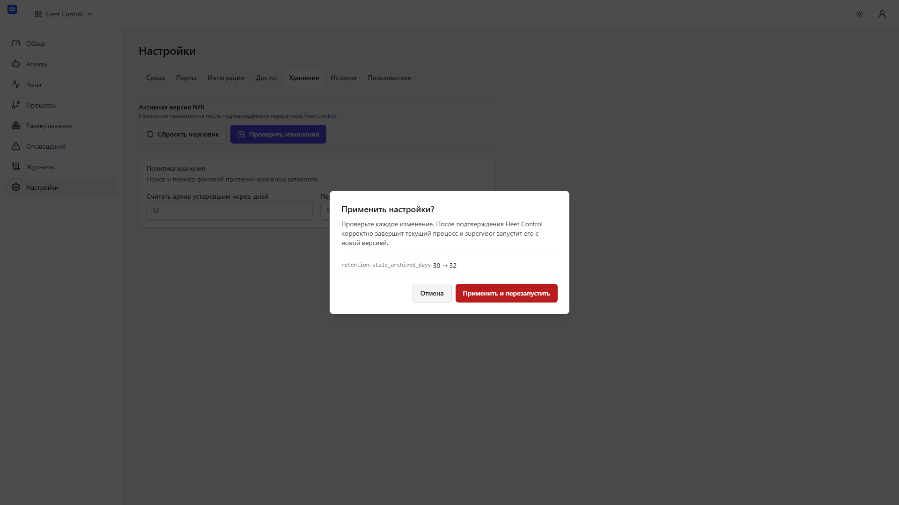
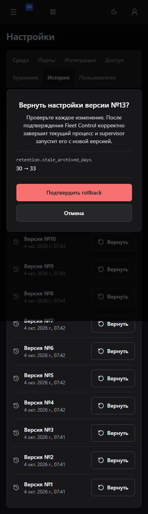

# Подтверждение managed settings

13 production-сценариев Chromium / Playwright 1.61.1: 12 сочетаний
375/768/1920/2560 × dark/gray/light для apply и отдельный rollback.
Использованы настоящий SSO, локальная тестовая роль operator, реальный API
и одноразовая PostgreSQL БД. Preview отвечает 200; конкурентная active version
даёт 409 до успешной записи и планирования restart. SQL-блокировка проверяет
pending: Cancel disabled, Escape сохраняет диалог. После ошибки Cancel/Escape
возвращают focus к кнопке preview или соответствующей строке истории; новый
preview не наследует старую ошибку. Tab остаётся внутри диалога, геометрия
проверена по viewport и темам. До выдачи локальной роли обычный пользователь
получил ожидаемый 403. Контейнеры временного Compose удалены.

18 unit-тестов настроек, 228 полных frontend-тестов и контрактные гейты прошли.
Браузерные fixtures: 36 сценариев Chromium/Firefox/WebKit прошли; 27 opt-in live
сценариев пропущены. Они не заменяют production-проверки выше или полную
приёмку PM/native/Pulse. API, backend, scopes, роли продукта, migrations,
Base pin и lockfiles сохранены. Accepted runtime не изменялся.

Точные source/image identifiers, наблюдения и SHA256 снимков находятся
в [evidence.json](evidence.json). Полная приёмка и три чистых ревью остаются
условиями merge всей задачи.

